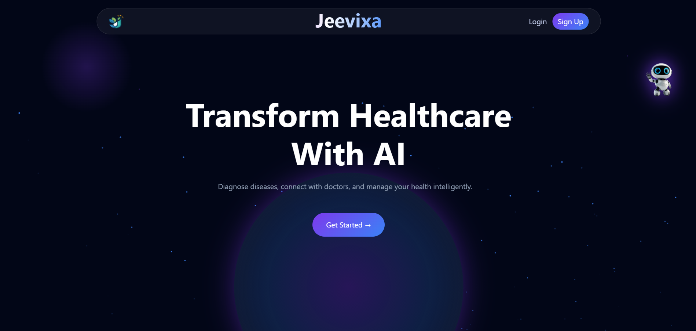
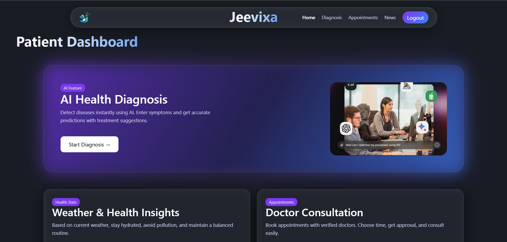
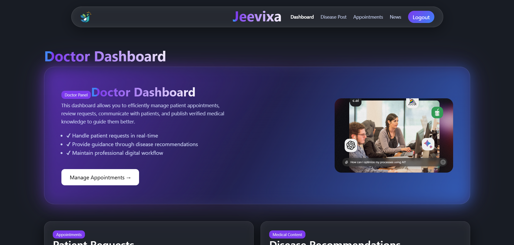

# 🧠 Jeevixa – AI Healthcare Platform

🚀 Live Demo: https://jeevixa.vercel.app/

---

## 📌 Overview

Jeevixa is an AI-powered healthcare web application that helps users predict diseases based on symptoms and provides medical guidance, reports, and doctor interaction features.

This project combines **Machine Learning + Full Stack Development** to deliver a modern healthcare experience.

---

## ✨ Features

* 🤖 AI Disease Prediction (ML Model using joblib)
* 🧑‍⚕️ Patient Dashboard
* 👨‍⚕️ Doctor Dashboard
* 📅 Appointment System
* 📰 Medical News Section
* 🌤 Weather-based Health Suggestions
* 📱 Fully Mobile Responsive
* 📲 Installable App (PWA)

---

## 🛠 Tech Stack

### Frontend

* React.js
* CSS (Custom UI + Glassmorphism)

### Backend

* Django (API only)

### Database

* MongoDB (Atlas)

### ML

* Scikit-learn (trained model using joblib)

### Deployment

* Vercel (Frontend)
* Django Server (Backend)

---

## 📸 Screenshots

> Add your screenshots here 👇

### Home Page



### Patient Dashboard



### Doctor Dashboard



---

## ⚙️ Installation (For Developers)

```bash
# Clone repo
git clone https://github.com/your-username/LiveHealth.git

# Frontend
cd Frontend/my-app
npm install
npm start

# Backend
cd Backend
pip install -r requirements.txt
python manage.py runserver
```

---

## 💡 Future Improvements

* Authentication (Google / JWT)
* Chat system between doctor & patient
* Advanced AI recommendations
* Notifications system

---

## 👨‍💻 Author

**Darshan Patel**

---

## ⭐ Show Your Support

If you like this project, give it a ⭐ on GitHub!
