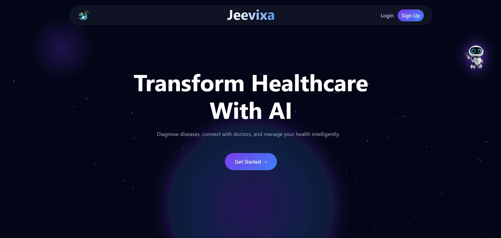
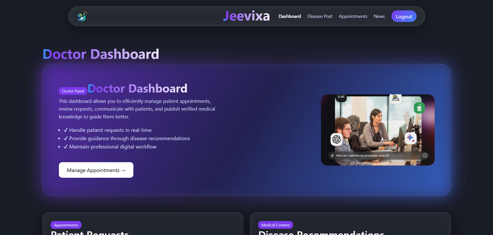

# Jeevixa (LiveHealth) - Full Project Analysis

Live demo: https://jeevixa.vercel.app/

## Project Overview

Jeevixa is a healthcare platform that combines:
- symptom-based disease prediction (ML inference),
- patient-doctor workflow (signup/login/appointments),
- doctor-side disease posting and recommendations,
- health-content support modules (news and related UI utilities).

The repository is structured as a full-stack application:
- `Frontend/my-app`: React SPA
- `Backend`: Django backend with REST-style endpoints and ML integration

---

## Repository Structure

```text
LiveHealth/
|- Frontend/
|  |- my-app/
|  |  |- src/
|  |  |  |- pages/          # Screens: Home, dashboards, appointments, etc.
|  |  |  |- components/     # Reusable UI + auth forms + navbars
|  |  |  |- config.js       # API base URL
|  |  |  |- App.js          # Route map
|  |  |- package.json
|
|- Backend/
|  |- Backend/              # Django project config (settings/urls/asgi/wsgi)
|  |- doctor/               # Main app: API views and route definitions
|  |- ml/                   # Prediction wrapper
|  |- utils/                # Symptom encoder, report generator, treatment engine
|  |- data/                 # JSON datasets for diseases/symptoms/treatment
|  |- requirements.txt
|  |- manage.py
|
|- README.md
```

---

## Tech Stack Analysis

### Frontend
- React (CRA-based setup with `react-scripts`)
- React Router for page navigation
- Axios/fetch for API calls
- Chart ecosystem present (`chart.js`, `react-chartjs-2`) for analytics UI
- Custom CSS-based styling and dark mode context

### Backend
- Django 5.x project with function-based API endpoints
- Django REST Framework decorators used in ML prediction route
- CORS enabled (`django-cors-headers`)
- Gunicorn listed for production serving

### Data and Storage
- MongoDB used directly through `pymongo` for core business data (`users`, `appointments`, disease posts)
- SQLite configured in Django settings (default DB engine still present)

### ML Layer
- Scikit-learn + joblib model loading
- Symptom encoding utility converts selected symptoms to model-ready vector
- Prediction response enriched with generated report + treatment plan

---

## Functional Modules (What the System Does)

1. **Authentication**
   - User signup with role-based fields (`doctor` or `patient`)
   - Password hashing/checking via Django hashers
   - Login returns user profile basics and role for frontend routing

2. **Appointments**
   - Patient can list doctors and create appointment requests
   - Doctor/patient can fetch filtered appointments
   - Doctor updates appointment status (`Pending/Accepted/Rejected`) with optional message

3. **Disease Prediction**
   - Accepts symptom list
   - Encodes symptom vector
   - Runs ML model inference
   - Returns structured output: report, treatment, and low-confidence warning

4. **Doctor Recommendations / Disease Posts**
   - Doctors can add disease posts/recommendations
   - Filtered retrieval by doctor email

5. **News and Dashboard UI**
   - Separate pages for patient/doctor news and dashboards
   - Routing is implemented centrally in `src/App.js`

---

## API Surface (Current Backend Routes)

Base routes are mounted from `Backend/doctor/urls.py`:

- `GET /` - home template response
- `POST /signup/` - create user account
- `POST /login/` - authenticate user
- `GET, POST, PUT /appointments/` - appointment CRUD-like operations
- `GET /doctors/` - list doctor profiles
- `GET /diseases/` - list disease posts
- `POST /stats/` - appointment status statistics for doctor
- `POST /disease-add/` - add disease entry
- `GET, POST /recommendations/` - recommendation list/create
- `POST /predict/` - ML disease prediction

---

## Frontend Route Map (User Navigation)

Defined in `Frontend/my-app/src/App.js`:
- `/` - Home
- `/login`, `/signup`
- `/PatientDashboard`, `/DoctorDashboard`
- `/Appointment-patient`, `/Appointment-doctor`
- `/disease-select`, `/disease-post`
- `/patient/news`, `/doctor/news`

`src/config.js` currently points API calls to:
- `https://jeevixa-backend.onrender.com`

---

## Screenshots

### Home Dashboard


### Doctor Dashboard


### Patient Dashboard


---

## End-to-End Data Flow

1. User opens React app and signs up/logs in.
2. Frontend calls Django endpoints using `BASE_URL`.
3. Backend validates payloads, stores/fetches documents from MongoDB.
4. For prediction, backend runs ML utilities and returns enriched response.
5. Frontend updates dashboard/appointment UI based on API responses.

---

## Setup Guide (Local Development)

## 1) Clone
```bash
git clone <your-repo-url>
cd LiveHealth
```

## 2) Backend setup
```bash
cd Backend
python -m venv venv
# Windows
venv\Scripts\activate
# macOS/Linux
# source venv/bin/activate

pip install -r requirements.txt
python manage.py runserver
```

Backend default:
- `http://127.0.0.1:8000`

## 3) Frontend setup
```bash
cd Frontend/my-app
npm install
npm start
```

Frontend default:
- `http://localhost:3000`

## 4) Connect frontend to local backend
Update `Frontend/my-app/src/config.js`:
```js
const BASE_URL = "http://127.0.0.1:8000";
export default BASE_URL;
```

---

## Deployment Notes

- Frontend is deployable on Vercel.
- Backend is deployable on Render/any Django-compatible host.
- Ensure CORS and allowed hosts are tightened in production.
- Move secrets/DB URIs to environment variables before production release.

---

## Current Observations (Engineering Analysis)

### Strengths
- Clear separation between UI and backend APIs.
- Useful healthcare workflow coverage (auth + appointment + prediction).
- ML response is user-friendly (report + treatment + warning).

### Risks / Gaps
- Sensitive values and DB connection details should not be hardcoded.
- Mixed Mongo usage patterns (Atlas URI in one place, localhost in others) can cause environment inconsistency.
- Django SQLite config exists but business data is primarily in MongoDB; data architecture can be unified.
- No strong token/session authorization layer on protected operations.
- Tests are minimal and should be expanded for API reliability.

### Suggested Next Improvements
- Introduce JWT auth and role-based endpoint protection.
- Centralize Mongo config via environment variables.
- Add backend tests for auth, appointment flow, and prediction endpoint.
- Add API documentation (OpenAPI/Postman collection).
- Add CI checks (lint + test) for both frontend and backend.

---

## Quick Commands

Backend:
```bash
cd Backend
python manage.py runserver
```

Frontend:
```bash
cd Frontend/my-app
npm start
```

---

## Author

Darshan Patel

If this project helps you, consider starring the repository.
    